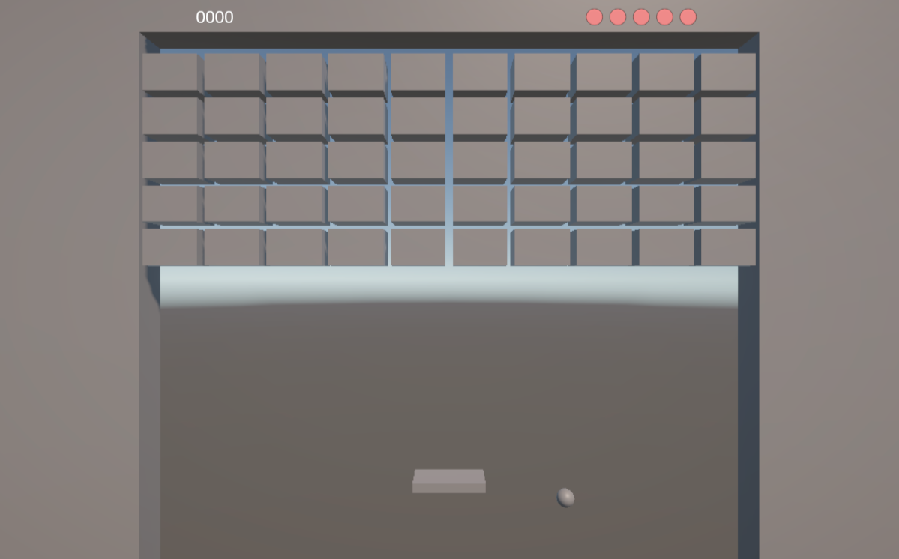
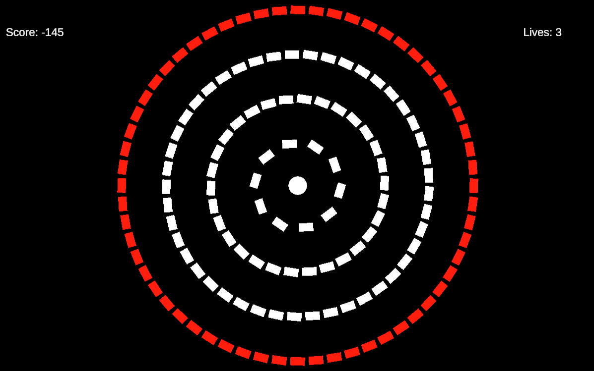
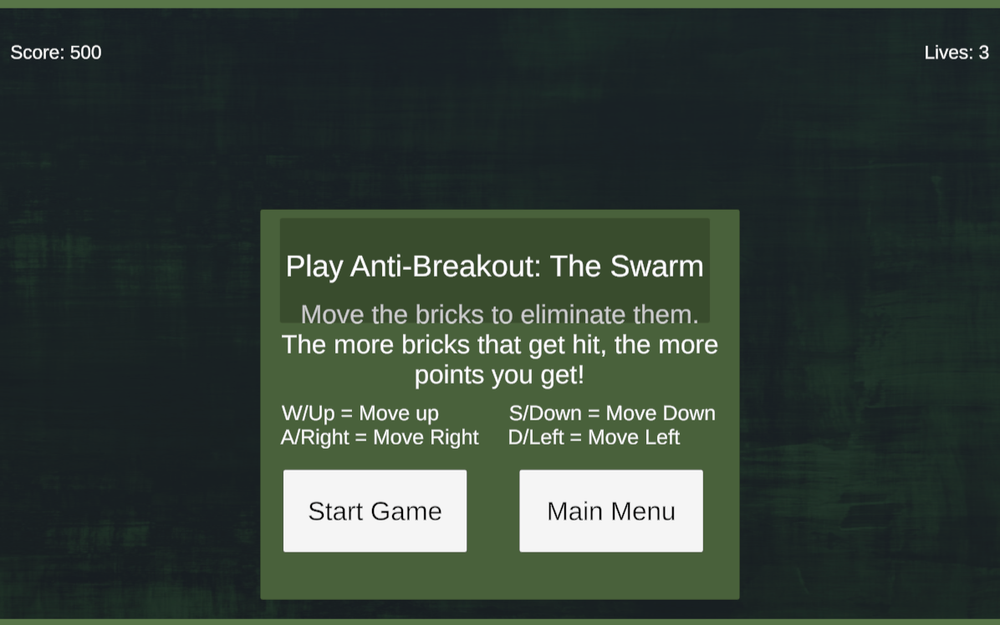
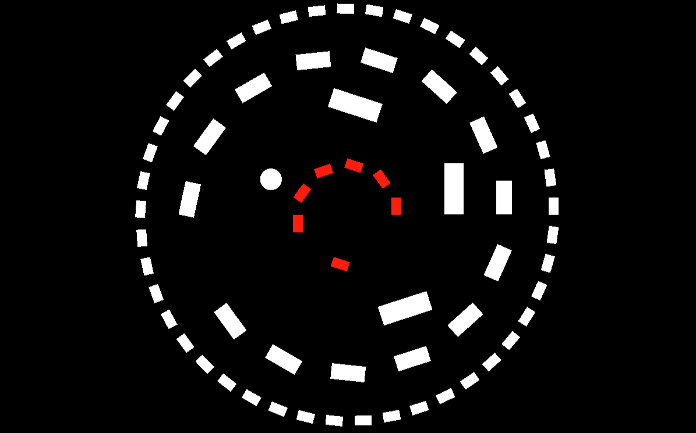
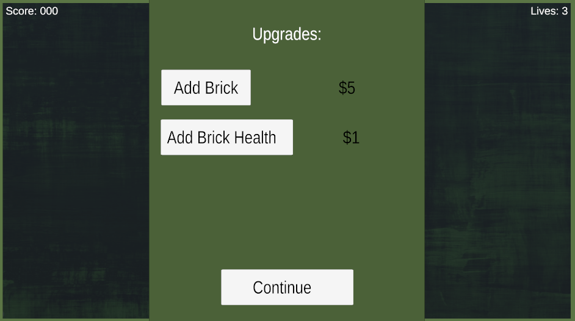

# Breakout Reflection
## Prototype 1

- What Were You Experimenting With Your Prototype?

Prototype 1 is a copy of Breakout. Protoype 1 was mainly to test out using Unity. Being new to game development, I wanted to mostly figure out the tools that Unity offers. I have experience in coding in the past, but wasn't too familiar with what was built into Unity such as the physics engine, prefabs etc. There wasn't anything significant added onto the game besides figuring out how fast I wanted the ball to move when it breaks bricks.

- What Did You Learn From Your Prototype?

I learned how to set up basic game mechanics such as ball movement and collision detection. I also learned how to set up the UI for the lives and score. Sometimes the ball would get stuck bouncing horizontally.

- Did You Learn Anything From Your Playtesters in Class? What?

There wasn't too much feedback to the game as it was very basic. I did learn about changing the paddle's collider body to be more round so the ball bounces better.

[Play Breakout Prototype 1](http://ArnoldTran.github.io/game-dev-spring2025/builds/breakout-1)

      

## Prototype 2

- What Were You Experimenting With Your Prototype?

I experimented with the idea of controlling the bricks instead of a paddle. The two prototypes follow this idea, where in one the bricks are in a ring format and you rotate them with the ball in the center. The other is a swarm of bricks where the goal is to collide with the ball in a given time limit to break all of the bricks.

- What Did You Learn From Your Prototype?

I learned to intantiate bricks in a circular pattern. I also learned how to work with a game manager and ui manager to better improve the game's visuals and organization. I messed around with different control schemes to see which felt better for players to use to control the rings.

- Did You Learn Anything From Your Playtesters in Class? What?

Playtesters told me that an indicator to show which brick ring was selected would help their gameplay. The Swarm prototype felt more difficult to control with how the stop function worked.

[Play Breakout Prototype 2a](http://ArnoldTran.github.io/game-dev-spring2025/builds/breakout-2a)

        

[Play Breakout Prototype 2b](http://ArnoldTran.github.io/game-dev-spring2025/builds/breakout-2b)

      

## Prototype 3

- What Were You Experimenting With Your Prototype?

I experimented with a ring selection system to better improve the player's feel of the game. Additionally, to create more interest in the game we added levels.

- What Did You Learn From Your Prototype?

Level balancing is difficult to manage. However, the game felt more like a full game with the addition of levels.

- Did You Learn Anything From Your Playtesters in Class? What?

I learned that looping the ring selection would make the game feel better to play. Additionally, the game itself is difficult, so maybe I need to change how the levels are set up.

[Play Breakout Prototype 3](http://ArnoldTran.github.io/game-dev-spring2025/builds/breakout-3)

      

## Prototype 4

- What Were You Experimenting With Your Prototype?

This build mostly had some final touches added onto the game, with no new features being added really. Most of the changes were polishing up the design.

- What Did You Learn From Your Prototype?

Polishing the game even a little bit can go a long way towards better gameplay.

- Did You Learn Anything From Your Playtesters in Class? What?

Balancing the game's difficulty is very challenging. However, even if the game is difficult that can be a reason as to why people continue playing the game.

[Play Breakout Prototype 4](http://ArnoldTran.github.io/game-dev-spring2025/builds/breakout-4)
