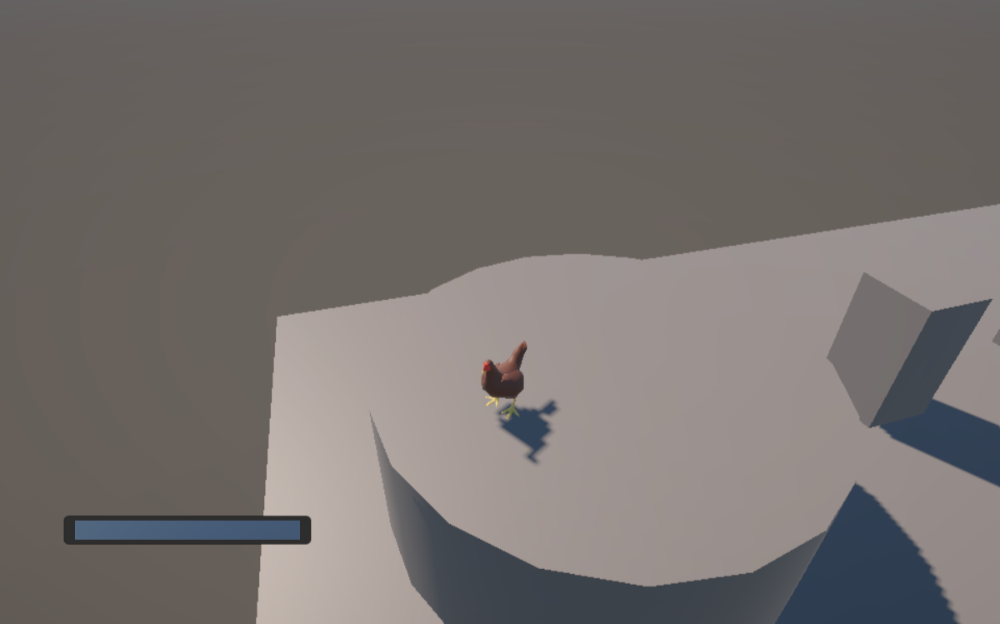
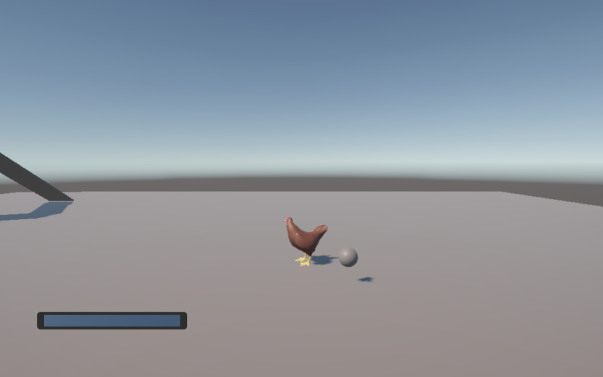

# Platformer Reflection
## Prototype 1

- What Were You Experimenting With Your Prototype?

My main experiment was to have more of a theme regarding my game, so I spent time animating and implementing a model of a chicken to better visualize what I wanted. The visual helped me get the feel of sprinting, jumping and fluttering of the character better. In addition, I implemented a stamina meter to give a form of limiter on the player.

- What Did You Learn From Your Prototype?

I learned ways to affect different velocities of the player, as well as camera movement. Additionally, the stamina meter helps to limit the player's movement and make the game more skill based by having something to manage. However, when the stamina meter reached 0, it resulted in the player stuttering if they tried to sprint, causing the bar to increase and decrease from 0 rapidly.

[Play Platformer Prototype 1] (http://ArnoldTran.github.io/game-dev-spring2025/builds/platformer-1)

      

## Prototype 2

- What Were You Experimenting With Your Prototype?

I experimented with adding collectables into the game that would impact the player's progression. The collectables were seeds that, when picked up, would decrease the cost of sprinting or gliding. I attempted to use Cinemachine for the camera controls. 

- What Did You Learn From Your Prototype?

I learned that adding the collectables gives the player a goal in progression for the game. The seeds allow the player to have a target in mind. By limiting the stamina meter with collectables, I can have specific areas only accessable after collecting enough of the seeds. Cinemachine was not functioning well for me, so I reverted my camera controls.

[Play Platformer Prototype Final] (http://ArnoldTran.github.io/game-dev-spring2025/builds/platformer-final)
