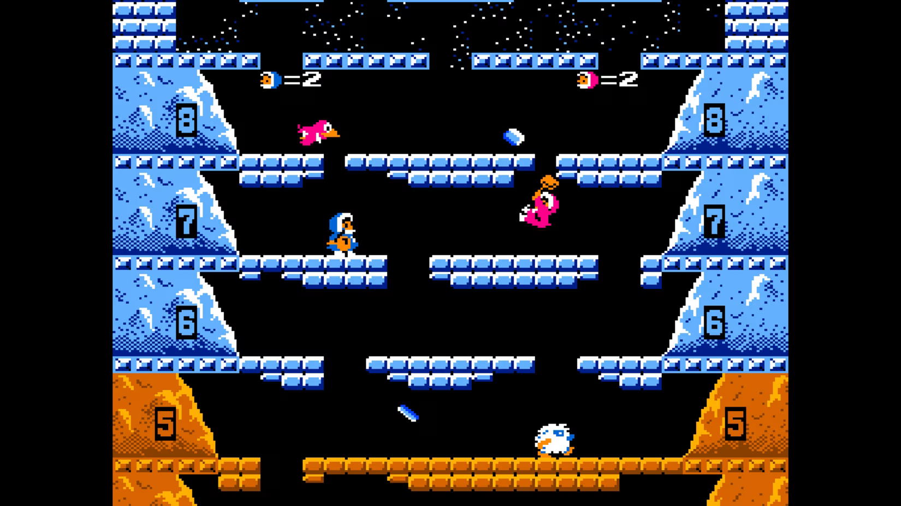
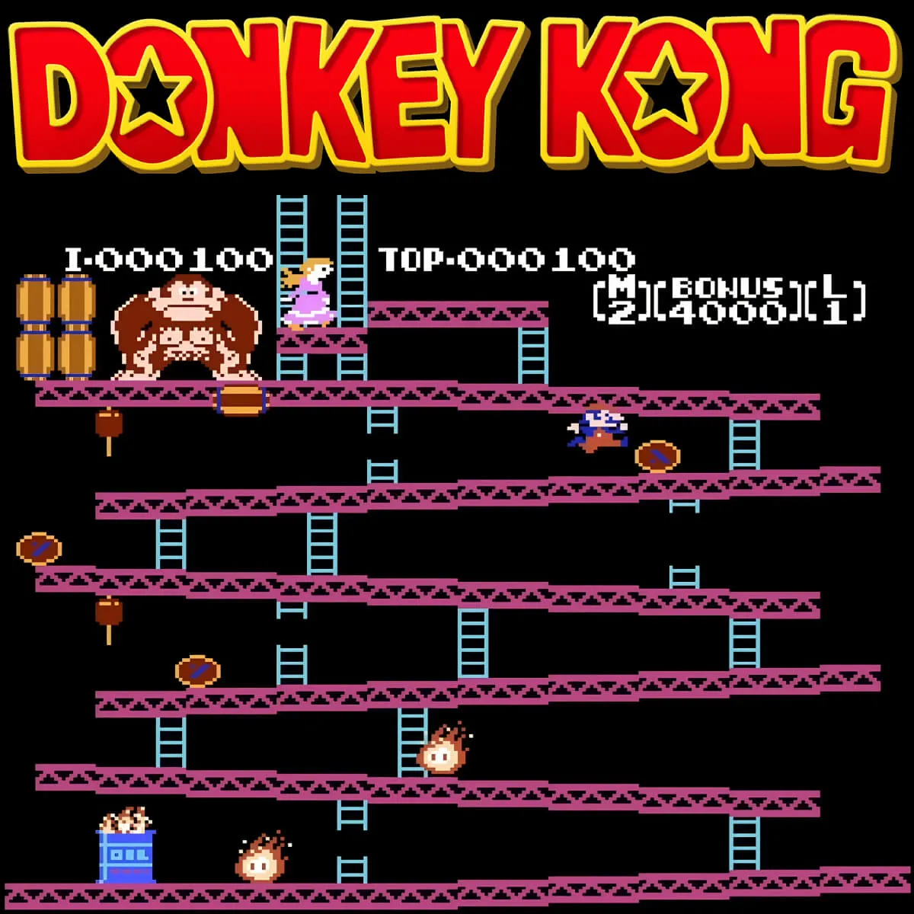
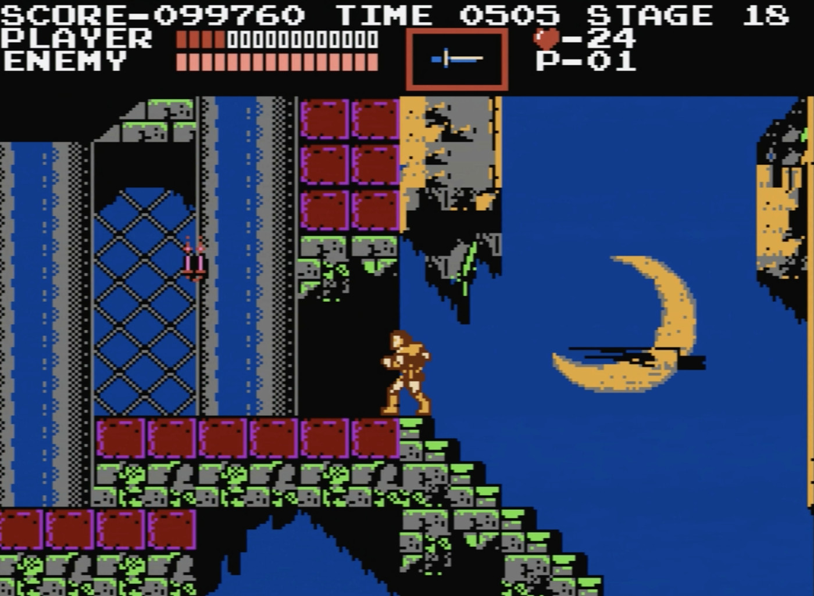

# Retro Platformers

## Ice Climber - Nintendo 1984

In *Ice Climber*, the player(s) control Popo (and Nana in two-player mode) as they climb a  mountain made of breakable ice layers. The game features environmental hazards, such as slippery platforms to replicate ice, making precise positioning difficult and strong winds causing players to have difficulties moving against it. Additionally, enemies appear to interfere with the players movement, blocking their path or adding more bricks to undo the player's progress

Jumping in *Ice Climber* has fixed verticality with little mid-air control. The player can only move slightly left or right after jumping. The primary challenge is breaking platforms above and successfully landing on them without slipping off.  

These movement limitations creates an emphasis on vertical progression. The platforms have small gaps that require precise jumps and planning which blocks to break. Enemies and falling icicles increase the difficulty, punishing mistimed jumps and poor positioning.  

---

## Donkey Kong - Nintendo 1981
 

*Donkey Kong* features a fixed running speed with a slight delay when stopping. He cannot change direction instantly, requiring careful maneuvering around hazards. The game makes Mario feel intentionally sluggish to focus on precise jumping and planning around obstacles. 

Mario's jump is arched and has limited mid-air control. The height and distance are fixed, so  players must commit to their jumps. Jumping over barrels and fireballs requires perfect timing, as there's no double-jumping or air correction to make room for errors.  

The level design capitalizes on these constraints, using angled platforms and ladders that dictate movement. The gaps between platforms require precision jumping, while barrels and enemies force quick decision-making. The ladders and moving platforms allow variations in each level that challenges the player's ability to navigate the space with limited movement freedom.  

---

## Castlevania - Nintendo 1986

In *Castlevania*, Simon Belmont moves very deliberately, feeling very precise and heavy. This game does not feature any sliding or other movement changing mechanics, making the movement feel rigid but predictable. However, when Simon stops or turns, it still take a split second to move.  

Jumping in *Castlevania*  are completely fixed in trajectory once executed. There’s no mid-air adjustment or adjustments that can be made when the player jumps. This means the player must carefully plan each jump, as a mistimed jump can result in falling into hazards or enemy attacks.  

The level design is built around this rigid movement system by demanding precision. There are stairs that can act as both pathways and obstacles, requiring deliberate positioning before climbing. The enemies are often positioned to force the player to commit to a risky jump or attack. Pits and moving platforms add tension, ensuring every jump must be carefully considered rather than reactionary which reinforces the game's slow, strategic pacing.
